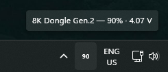

# mousebatt

A tiny Windows system-tray battery monitor for Pulsar and VAXEE wireless gaming mice.
The current battery percentage is drawn directly onto the tray icon.



- ~300 KB single exe, no runtime, no installer
- Zero CPU while idle — event-driven Win32, no polling threads
- Pure Rust; the only dependency is [`windows-sys`](https://crates.io/crates/windows-sys) (no hidapi, no GUI framework)

## Supported devices

| Vendor | Tested with | Connection |
|---|---|---|
| Pulsar (VID `0x3710`) | X3 LHD CrazyLight mini / Medium | wired and 8K Dongle Gen.2 |
| VAXEE (VID `0x3057`) | XE-S | 4K wireless dongle |

Other mice from these vendors that use the same receivers/firmware will likely work,
since devices are matched by vendor ID + HID usage page rather than specific product IDs.

## What it does

- Polls the mouse every 4 minutes over the vendor HID interface
- Re-reads immediately when a USB device is plugged/unplugged (debounced) and on resume from sleep
- Icon text color: white = normal, green = charging, red = ≤20%, gray = stale/no data
- Tooltip shows model name, percentage, charging state, polling rate, and battery voltage (Pulsar only)
- Left-click = refresh now; right-click = menu with **Refresh**, **Polling rate**, **Start with Windows**, **Exit**
- **Polling rate** lists the rates the current link supports with the active one checked;
  picking one writes it to the mouse, the same setting the vendor's web driver changes.
  Pulsar: 125 Hz–1 kHz on cable, up to 8 kHz on the 8K dongle. VAXEE: 500 Hz–4 kHz on the
  4K dongle (1 kHz max on cable or in a "Standard" tracking mode)

If the mouse is asleep and doesn't answer, the last known value is shown in gray and
marked stale in the tooltip — it recovers on the next poll.

## Installing

Grab `mousebatt.exe` from the [latest release](https://github.com/ryanlewis/mousebatt/releases/latest)
and run it — there is nothing to install. Use **Start with Windows** in the right-click menu
to have it launch at logon.

The exe is not code-signed, so SmartScreen will warn the first time you run it
(**More info → Run anyway**). Each release lists the SHA-256 of the binary if you want to verify it.

## Building

Requires the Rust toolchain (1.80 or newer) with the MSVC target.

```
cargo build --release
```

The binary lands in `target/release/mousebatt.exe`. Run it — it lives entirely in the tray.
Windows 11 hides new tray icons in the overflow flyout by default; drag it onto the
taskbar (or enable it under taskbar settings) to keep it visible.

## Notes on the hardware

These mice estimate charge from battery voltage (no coulomb counting), so the
percentage jumps up when you plug in and sags back when you unplug — that's the
firmware's estimate, not a bug here. Treat readings as roughly ±10%.
VAXEE reports in 5% steps and does not expose voltage.

Polling happens over the wireless link, so the interval defaults to 4 minutes (`POLL_INTERVAL_MS` in `src/main.rs`).

## Protocol credits

The vendor protocols were reverse-engineered by the community:

- Pulsar: same protocol as the Linux [`hid-kysona`](https://github.com/torvalds/linux/blob/master/drivers/hid/hid-kysona.c) driver
  (17-byte report `08 04 … 49`; battery %, charging flag, and voltage in the reply),
  also documented via [jonkristian/pulsar-x3-python](https://github.com/jonkristian/pulsar-x3-python).
  The settings register map (polling rate at address `0x0000`, link type from the
  `0x01` info reply) comes from [packerlschupfer/pulsar-mouse-linux](https://github.com/packerlschupfer/pulsar-mouse-linux)
  and [andrewrabert/python-pulsar-mouse-tool](https://github.com/andrewrabert/python-pulsar-mouse-tool)
- VAXEE: feature-report protocol documented in [stuffz/mouse-battery-monitor](https://github.com/stuffz/mouse-battery-monitor);
  the polling-rate (`0x07`) and tracking-mode (`0x08`) commands follow the
  [VAXEE Control Center](https://vcc.vaxee.co/) web driver

## Privacy

mousebatt makes no network connections and collects nothing. It only opens HID
interfaces whose vendor ID is Pulsar or VAXEE, sends the vendor's battery query,
and reads the reply. The only thing it ever writes to a mouse is the polling rate you
pick from the menu. The "Start with Windows" toggle writes one value under
`HKCU\Software\Microsoft\Windows\CurrentVersion\Run`.

## Adding a mouse

Devices are matched by vendor ID and HID usage page in `src/protocol.rs`
(`read_battery`), and the two vendor protocols live in the same file as pure
functions with unit tests. To add support for another mouse:

1. Find its VID/PID and the vendor-specific usage page (Device Manager → Details →
   *Hardware Ids*, or any HID enumeration tool).
2. Work out the battery request/response — the linked projects below and the Linux
   `hid-*` drivers are the best starting points.
3. Add a `parse_*` function with a test using a captured reply, and a branch in `read_battery`.

Issues and PRs for other Pulsar/VAXEE models (or other vendors) are welcome; please
include the product string from the tooltip and, ideally, a captured report.

## License

[MIT](LICENSE).
